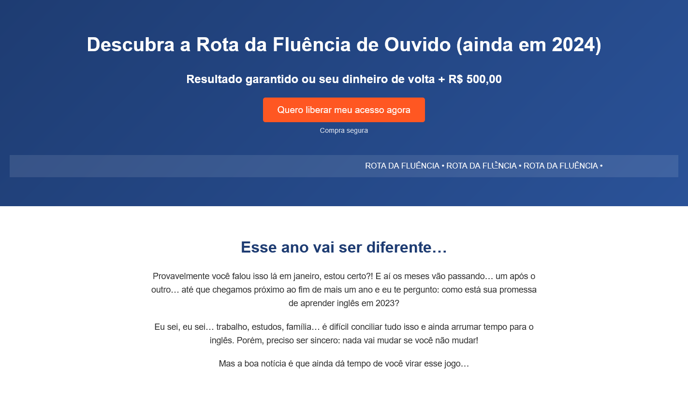
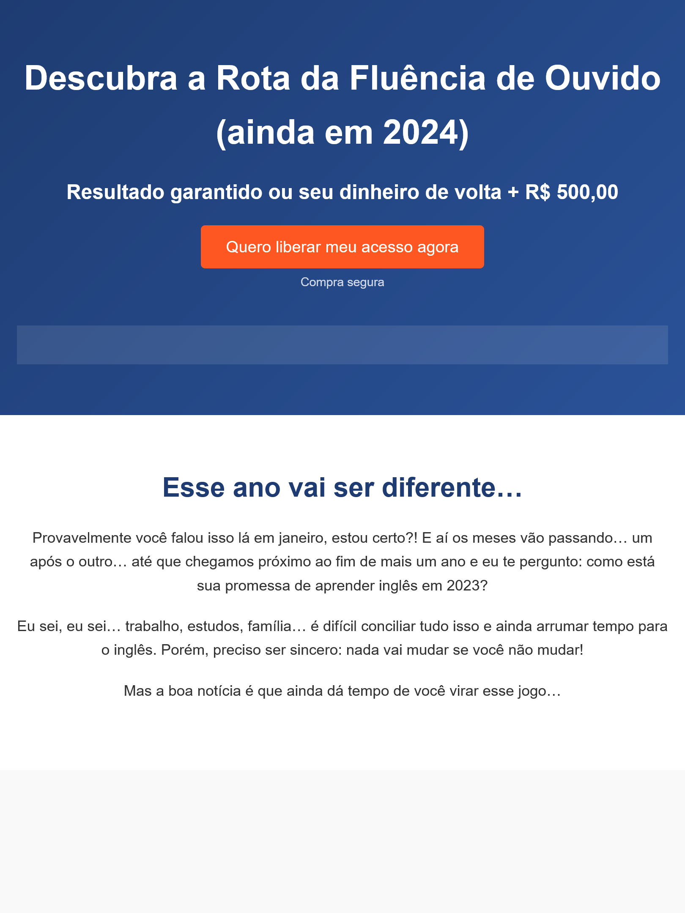
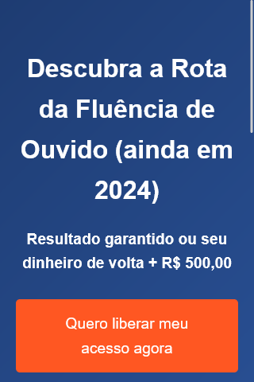

# Landing Page - Rota da Fluência

Este projeto é uma landing page desenvolvida como parte de um teste prático para o processo seletivo de Web Designer. A página foi criada utilizando **HTML** e **CSS puro**, seguindo boas práticas de desenvolvimento web, semântica e responsividade.

---

## 📌 Visão Geral

A landing page consiste em duas seções principais:
1. **Hero Section**: Apresenta o título, subtítulo, botão CTA e uma faixa deslizante animada.
2. **Segunda Dobra**: Contém um texto motivacional sobre a importância de aprender inglês.

O projeto foi desenvolvido com foco em:
- **Design responsivo**: Funciona em dispositivos móveis, tablets e desktops.
- **SEO**: Meta tags para melhorar a indexação em motores de busca.
- **Acessibilidade**: Uso de tags semânticas e atributos para melhorar a experiência do usuário.
- **Interatividade**: Botão CTA que redireciona para a página oficial da Idiomus.

---

## 🚀 Como Executar o Projeto

1. **Clone o repositório**:
   ```bash
   git clone https://github.com/rafaelferreira2312/landing-page-idiomus.git
   ```
2. **Abra o projeto**:

   - **Navegue até a pasta do projeto**:
        ```bash
        cd landing-page-rota-da-fluencia
        ```

    - **Abra o arquivo index.html no seu navegador**.

    - **Visualize as capturas de tela**:

        - As capturas de tela da página em diferentes dispositivos estão na pasta screenshots.

3. 📂 **Estrutura do Projeto**
```bash
landing-page/
├── index.html
├── style.css
├── assets/
│   └── favicon.ico
├── screenshots/
│   ├── desktop.png
│   ├── tablet.png
│   └── mobile.png
└── README.md
```
4. 🖼️ **Capturas de Tela**
### Desktop


### Tablet


### Mobile


5. 🛠️ **Tecnologias Utilizadas**

    - HTML5: Estrutura semântica da página.
    - CSS3: Estilização e animações.
    - Favicon: Ícone da página.
    - Meta Tags: Otimização para SEO.

6. 📝 **Decisões de Design e Desenvolvimento Cores**

    - Utilizei tons de azul (#1e3c72 e #2a5298) para transmitir confiança e profissionalismo.
    - O botão CTA em laranja (#ff5722) chama a atenção e incentiva a ação.

7. **Tipografia**

    - A fonte Poppins foi escolhida por ser moderna e legível.

8. **Responsividade**

    - Media queries foram utilizadas para ajustar o layout em diferentes dispositivos.

9. **SEO**

    - Meta tags como title, description, keywords, og:title, og:description e og:image foram adicionadas para melhorar a indexação e o compartilhamento em redes sociais.

10. **Interatividade**

    - O botão CTA redireciona para a página oficial da Idiomus (https://idiomus.com/).

## 📄 Documentação Adicional

Para mais detalhes sobre as decisões de design e desenvolvimento, consulte o arquivo [PDF](documentacao.pdf) incluso no projeto.

## 📧 Contato

Se tiver alguma dúvida ou sugestão, entre em contato:
- **Email**: rafaelferreira2312@gmail.com   
- **LinkedIn**: [Rafael Ferreira da Silva](https://www.linkedin.com/in/rafael2312/)
